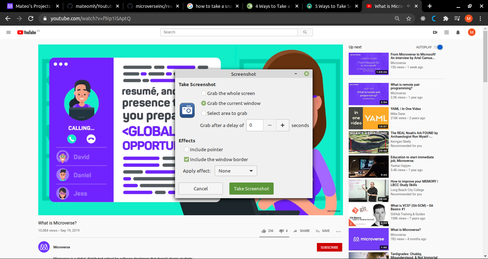

# YOUTUBE CLONE PAGE

> The objective of the project is to mimic a youtube video page with the navbar, the video display section and the sidebar with the upcomming videos. The base page taken was the current youtube video page .

This was the main page we tried to replicate using just CSS and HTML, so no actual videos are linked in the project or dynamic data shown.

## Live Version

- URL: https://rawcdn.githack.com/mateomh/Youtube-Clone/e2c280df983c54d2c5e4c619ead76a1e7e3df721/index.html 

## Built With

- HTML, CSS,
- No frameworks were used,

## Authors

👤 **Mateo mojica**

- Github: [@mateomh](https://github.com/mateomh)
- Twitter: [@Mateom77199196]
- LinkedIn: http://linkedin.com/in/mateo-mojica-hernandez

👤 **Rafael Cavalheiro**

- Github: [@rgcavalheiro](https://github.com/githubhandle)
- Twitter: [@rgcavalheiro]
- LinkedIn: linkedin.com/in/rafael-cavalheiro-00415b94

## 🤝 Contributing

Contributions, issues and feature requests are welcome!

Feel free to check the [issues page](issues/).

## Show your support

Give a ⭐️ if you like this project!

## 📝 License

This project is [MIT](lic.url) licensed.