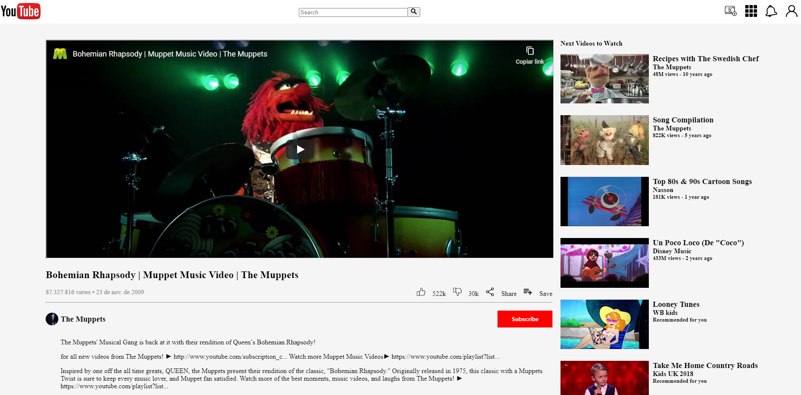

# YOUTUBE CLONE PAGE

> The objective of the project is to mimic a youtube video page with the navbar, the video display section and the sidebar with the upcomming videos. The base page taken was the current youtube video page .

This was the main page we tried to replicate using just CSS and HTML, so no actual videos are linked in the project or dynamic data shown.

## Built With

- HTML, CSS,
- No frameworks were used,

## Authors

👤 **Mateo mojica**

- Github: [@mateomh](https://github.com/mateomh)

👤 **Rafael Cavalheiro**

- Github: [@rgcavalheiro](https://github.com/githubhandle)

## 🤝 Contributing

Contributions, issues and feature requests are welcome!

Feel free to check the [issues page](issues/).

## Show your support

Give a ⭐️ if you like this project!

## 📝 License

This project is [MIT](lic.url) licensed.